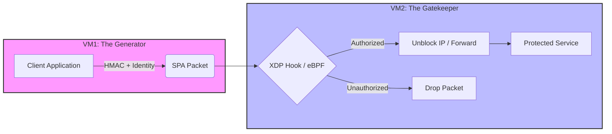

# Identity-Driven SPA via eBPF for Stealthy Zero Trust Gateways


-orange)

Identity-Driven Single Packet Authorization (SPA) using eBPF/XDP for Stealthy Zero Trust Gateways, based on NIST SP 800-207.

## Overview

This project explores the implementation of a high-performance, identity-driven Zero Trust Architecture (ZTA). By leveraging Single Packet Authorization (SPA) and offloading the validation process to the kernel level using eBPF/XDP, we achieve near-zero overhead and maximum stealth for the gateway. 

Conventional SPA implementations often rely on userspace processing, which can be vulnerable to resource exhaustion. This research demonstrates a transition from legacy userspace processing (Phase 0) to hardware-accelerated, kernel-level validation (Phase 1).

## Architecture

The following diagram illustrates the flow of the Identity-Driven SPA packet from the generator to the gatekeeper.



## Getting Started (Phase 0: Baseline)

Follow these steps to run the legacy Phase 0 simulation, which uses standard userspace processing.

### 1. Prerequisites
- Rust (for the generator)
- Python 3.x (for the receiver)

### 2. Run the Gatekeeper (Receiver)
Navigate to the receiver directory and run the legacy Python script:
```bash
cd vm2_receiver/phase0_legacy
python receiver.py
```

### 3. Run the Client (Generator)
In a separate terminal, run the Rust-based packet generator:
```bash
cd vm1_generator
cargo run -- --phase p0
```

## Research Roadmap
- [x] **Phase 0**: Legacy Userspace Implementation (HMAC + Python/Iptables).
- [/] **Phase 1**: eBPF/XDP Optimization (Rust Aya/C + Kernel Hook).
- [ ] **Phase 2**: Benchmarking and Metric Aggregation under Stress.

## References
- NIST SP 800-207: Zero Trust Architecture.
- eBPF/XDP Documentation: [ebpf.io](https://ebpf.io/)
